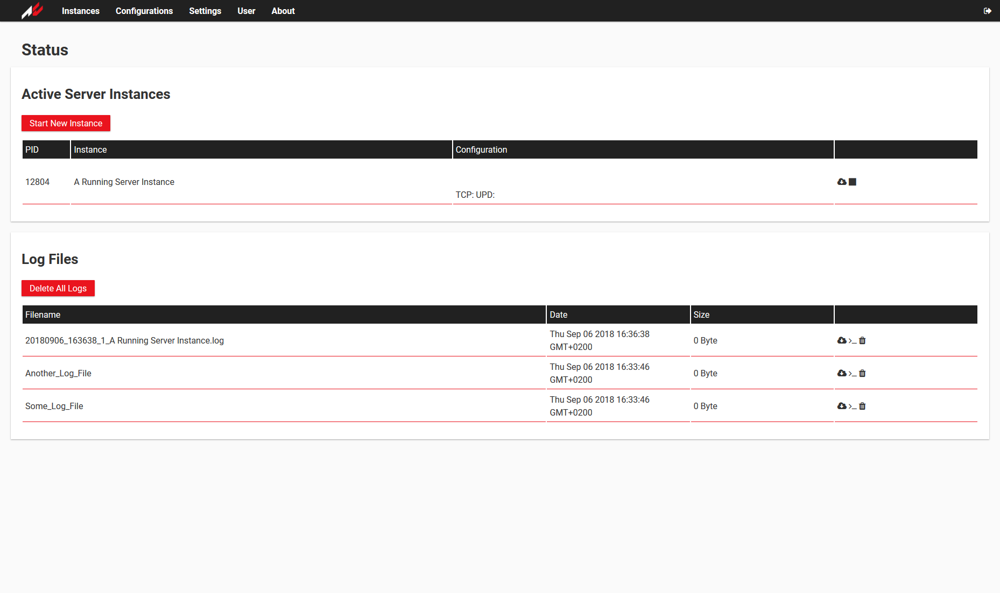
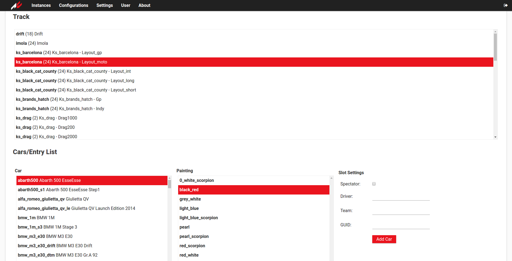
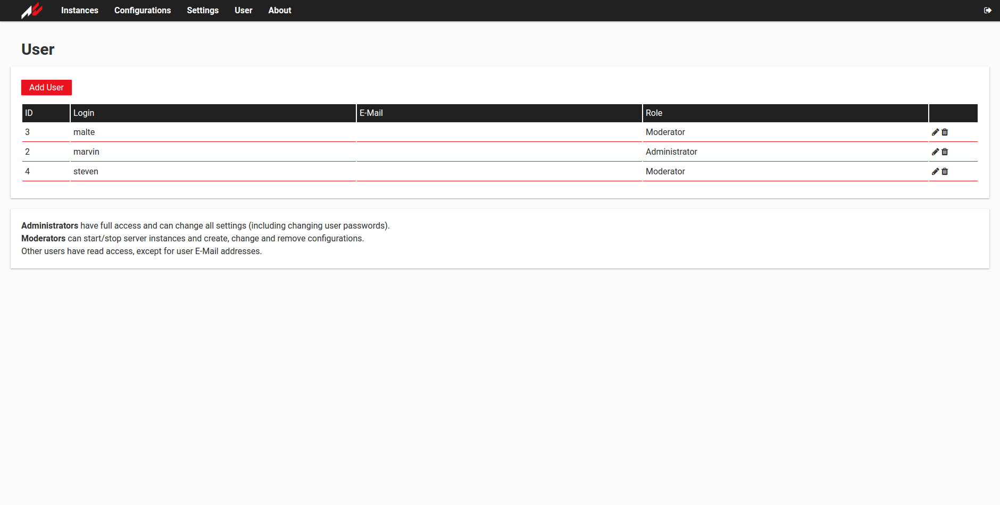

# Assetto Corsa server web interface

This tool provides monitoring and management for your Assetto Corsa server instances. You can create multiple configuration profiles, start/stop server instances and watch the status of them.

## Screenshots








## Install using Docker

*WIP*

## Manual installation

This instruction supposes you to use Linux. On Windows you basically need to perform the same steps. You need a MySQL database and rights to upload and execute applications. I recommend to create a user for your web interface installation.

1. download the latest release of acweb
2. upload it to your server and unzip it
3. create the database schema (db/schema.sql) and create the first user:

```
INSERT INTO `user` (`id`, `login`, `email`, `password`, `admin`, `moderator`) VALUES (NULL, 'username', 'user@email.com', 'SHA256_HASH', '1', '0');
```

4. set the environment variables to configure your server:

```
# acweb host, to make it accessible from the outside use 0.0.0.0:PORT
export ACWEB_HOST=localhost:8080
# optional log file location (will be created if it doesn't exist)
export ACWEB_LOGDIR=
# path to TLS private key file
export ACWEB_TLS_PRIVATE_KEY=
# path to TLS cert file
export ACWEB_TLS_CERT=
# database user
export ACWEB_DB_USER=root
# database password
export ACWEB_DB_PASSWORD=
# database host (most likely tcp(localhost:3306))
export ACWEB_DB_HOST=
# database name:
export ACWEB_DB=acweb
```

5. start it ./acweb
6. you can now visit your web interface

## Updating

1. download the latest release
2. upload it to your server and unzip it
3. cp the config.json from the old version to the new version
4. update your MySQL database (migration scripts can be found in db/mig_FROMVERSION_TOVERSION.sql)
5. start it

## Adding tracks and cars

To add tracks and cars, from a mod for instance, you must add them to the cars.json and tracks.json configuration files to make them appear in the web interface:

```
[
    // a track
    {
        "name": "NAME",
        "config": "CONFIG_TRACK",
        "description": "Name",
        "max_slots": NUMBER_OF_SLOTS
    },
    // ...
```

```
[
    // a car
    {
        "name": "CAR_NAME",
        "description": "Car Name",
        "paintings": [
            "SKIN_0",
            "SKIN_1",
            // ...
        ]
    },
    // ...
```

## License

MIT
